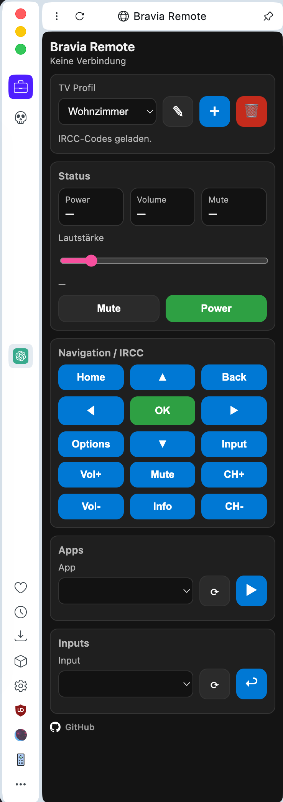
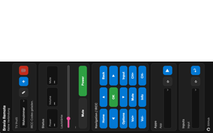

# Opera Bravia Remote

Opera Sidebar extension to control Sony Bravia TVs via the official Bravia REST API.

## Features
- Sidebar integration
- Multiple TV profiles
- Power / Volume / Channel control
- App launcher
- Input switching
- Local network only (no cloud)

## Installation (Developer Mode)
1. opera://extensions
2. Enable Developer Mode
3. Load unpacked
4. Select project folder

## Privacy
No data leaves your network.
TV URL and PSK are stored locally in browser storage.

## License
MIT

## Screenshots
## Screenshots

